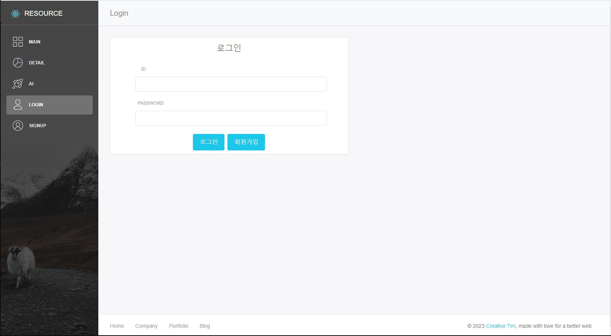

<h1 align="center"> 원자재 Ai 가격예측서비스 프로젝트 프론트엔드 💻 </h1>


## 🛠️ 기술 스택

<h4>Front Tool</h4>
   

<h4>Design Library</h4>
   

<h4>Cooperation Tool</h4>
    
 


## 🤹🏻 기술 스택 선정 이유
- React : 리액트가 유명하다더라
- axios : 비동기통신할라고 한거지 뭐
- 디자인 라이브러리


## 📌 프로젝트 목표

```sh
리액트를 활용해서 상품과 ~~~~~~~~와 판매량 예측을 실시간으로 모니터링할 수 있는 대시보드를 구현하였습니다! 
리액트를 활용하면서 복잡한 상태 관리는 리덕스로 ~~~~~~    SPA ~~~~~~ 비동기 통신 ~~~~
```


## 📄 UI/UX 설계도

<center>
    <h4>원자재 현황차트</h4>
    
</center>

<br/>

<center>
    <h4>상세정보 페이지</h4>
    
</center>

<br/>

<center>
    <h4>가격예측 페이지</h4>
    
</center>

<br/>

<center>
    <h4>로그인 페이지</h4>
    
</center>

<br/>

<center>
    <h4>회원가입 페이지</h4>
    
</center>

<br/>


## 🔍 Overview

### 1. 원자재 현황 페이지

<center>
    
</center>
<p>👉원자재 가격에 대한 추이를 한 눈에 볼 수 있도록 Axios로 가져온 원자재 원천데이터를 불러와</p>
<p>Apexcharts 라이브러리를 사용하여 니켈, 리튬, 철스크랩, 코발트의 총 4개의 차트로 현황 내역을 제공합니다.</p>

<br>

### 2. 상세 정보 페이지

<center>
    
</center>
<p>👉드롭박스 버튼으로 원자재 종류와 원하는 기간을 선택하면</p>
<p>해당 자재 차트와 관련 뉴스 기사를 제공합니다.</p>

<br>

### 3. AI 가격예측 페이지

<center>
    
</center>
<p>👉현재 일자 기준으로 AI모델을 적용한 7일 단위의 결과값을 차트로 제공합니다.</p>

<br>

### 4. 사용자 회원 가입 및 로그인 페이지

<center>
    
    
</center>
<p>👉JWT Token 방식 기반으로 해당 ID의 고유 Token을 인증하여 로그인 성공실패를 좌우합니다.</p>
<p>새로운 사용자라면 회원가입을 통해 사용자로 등록될 수 있습니다.</p>

<br>
